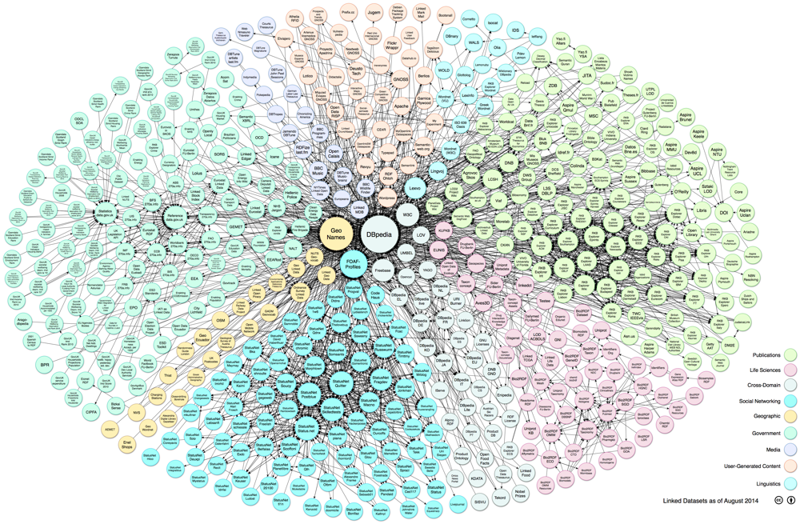
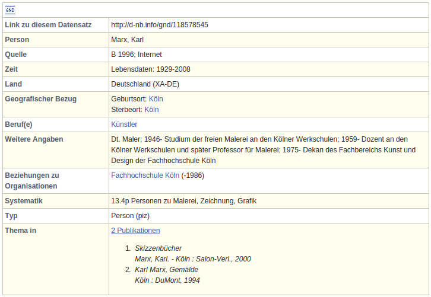
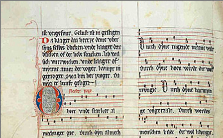
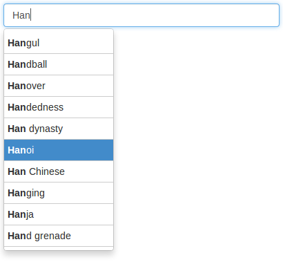

# Im Wald



# Häh?

* Alles hängt irgendwie mit allem zusammen
* Hier: **Daten** die mit anderen Daten zusammenhängen
* Linked Open Data

# Daten die mit anderen Daten zusammenhängen

* Verschiedene Daten beschreiben die gleiche Dinge

* Zum Beispiele **die gleiche Person**
    * Person als Autor in Katalogdatenbank
    * Objekte der Person im Bestandsverzeichnis eines Museums
    * Wikipedia-Artikel über die Person
    * ...

*Linked Open Data ist überall relevant, wo in verschiedenen Einrichtungen Daten
über gleiche Dinge verwaltet werden*

# Old School Linked (Open) Data: authority files

Normdaten
  : Personenverzeichnis, Klassifikation, Thesaurus...
Kontrollierte Vokabulare
  : statt Hymonyme und Synonyme
Identifier
  : Notation, ID-Nummer...

**Grundidee:** Eindeutige Referenzierbarkeit

> "things, not strings"

# *things, not strings* -- ein Beispiel

1. "Autor: Karl Marx"\
   "Autor: Karl Marx (Künstler)"

2. "Autor:" <http://d-nb.info/gnd/118578545>

3. Eigenschaft: <http://purl.org/dc/terms/creator>\
   Gegenstand: <http://d-nb.info/gnd/118578545>

$\Rightarrow$ Linked Open Data

# Linked Open Data

1. **Data**

    Daten in RDF

    HTTP-URIs als Identifier

2. **Open**

    abrufbar per HTTP-URIs

2. **Linked**

    mit Links zu anderen HTTP-URIs

# Beispiel: <http://d-nb.info/gnd/118578545>



# Beispiel: <http://d-nb.info/gnd/118578545>^[<http://www.easyrdf.org/converter>]
 
```
@prefix foaf: <http://xmlns.com/foaf/0.1/> .
@prefix gnd: <http://d-nb.info/standards/elementset/gnd#> .
@prefix owl: <http://www.w3.org/2002/07/owl#> .

<http://d-nb.info/gnd/118578545>
  gnd:preferredNameForThePerson "Marx, Karl" ;
  gnd:professionOrOccupation
    <http://d-nb.info/gnd/4033423-5> ;
  foaf:page 
    <http://de.wikipedia.org/wiki/Karl_Marx_%28Maler%29> ;
  owl:sameAs <http://viaf.org/viaf/96119561> .

<http://d-nb.info/gnd/4033423-5>
  gnd:preferredNameForTheSubjectHeading "Künstler" .
```

# Daten in RDF

* Alle Dinge werden mit einer URI identifiziert\
* Alle Daten bestehen aus einzelnen Aussagen (**Triples**)
    * Subjekt (immer eine URI)^[abgesehen von blank nodes]
    * Property (Eigenschaft identifiert durch eine URI)
    * Objekt (Zeichenkette oder URI)$^2$

Beispiel:

S
  : <http://d-nb.info/gnd/11857854>
P
  : <http://d-nb.info/standards/elementset/gnd#>\
    `professionOrOccupation`
O
  : <http://d-nb.info/gnd/4033423-5>

# Ontologien

* Definition von Eigenschaften

* **Einheitliche** Eigenschaften

    * `gnd:preferredNameForThePerson`
    * `foaf:name` (<http://xmlns.com/foaf/0.1/name>)
    * `schema:name` (<http://schema.org/name>)
    * ...

* z.B.Katalogisierung mit RDA basiert auf einer RDF-Ontologie,
  andere Datenmodelle lassen sich auf Ontologien abbilden

* Ontologien sind allerdings auch mischbar!


# Katalogisierung: Intellektuelle Erstellung von Daten

1. Zeichenketten oder andere Digitalisate
2. Verknüpfungen


# Zeichenketten oder andere Digitalisate



*nur genau einmal notwendig, danach Verknüpfungen*


# Verknüpfungen

* Auswahl aus bereits vorhandenen URIs
* Mit geeigneten Hilsfmitteln 




# Vor- & Nachteile

* Vorteile

    * Einheitliches Datenformat
    * Verfügbarkeit der Daten
    * Flexibleres Zusammenführen und Ausschnitte bilden

    $\Rightarrow$ Mehrwert durch *Zusammenarbeit*

* LOD macht keinen Sinn wenn...

    * Alle Daten selber erfasst und genutzt werden sollen

    $\Rightarrow$ Zusammenarbeit nicht gewünscht ist


# Konzeptuelle Nachteile

* Nicht alle Daten lassen sich gleich gut in RDF ausdrücken\
  (z.B. Hierarchien, Reihenfolgen...)
* Datenmodellierung ist kompliziert\
  weil die Dinge kompliziert sind

Ggf. reichen auch erstmal andere Formate, sofern URIs dabei sind
(CSV-Tabellen, BEACON-Linkdumps...)


# Zusammenfassung

* Alles lässt sich mit allem verknüpfen (mittels URIs)
* Katalogisierung ist Verknüpfung oder Digitalisierung
* Tripel als kleinste Dateneinheit
    * leichte Nachnutzung und Zusammenführung
    * Gemeinsame Nutzung von RDF-Eigenschaften & Ontologien
* Massenweise Verknüpfungen


# Linking Open Data cloud diagram


# Weiterführendes, Quellen und Lizenz

SWIB
  : Semantic Web in Libraries (seit 2009)\
    <http://swib.org/>

LODLAM
  : Linked Open Data in Libraries, Archives, and Museums (seit 2011)\
    <http://lodlam.net>

*Linking Open Data cloud diagram* (2014) by Max Schmachtenberg, Christian Bizer,
Anja Jentzsch and Richard Cyganiak <http://lod-cloud.net/> 


